# Enhance Your GitHub Profile with Automated Data Insights and Visualizations

## Automatically showcase detailed analytics of your Python repositories via github actions.

### This tool automatically generates insightful data visualizations and key statistics for your repositories, updating your GitHub profile on every push. It seamlessly integrates with your existing profile and appends new information at the bottom so your content stays intact. The graphs that are generated are stitched together in a gif so your profile can remain concise and clean.

Analyze, generate and display visuals for your code in relation to:
- Repositories by commits, line count (of python code)
- A heatmap of your commit activity by day and time
- A word cloud of commit messages
- File type count
- Libraries used (Python)
- Construct counts (count of Loops, classes, control flow statements, async functions etc...)
- Highlights of your most recent closed PRs and commits

Keep your profile engaging with real-time data, without any extra work—everything runs automatically through GitHub Actions.


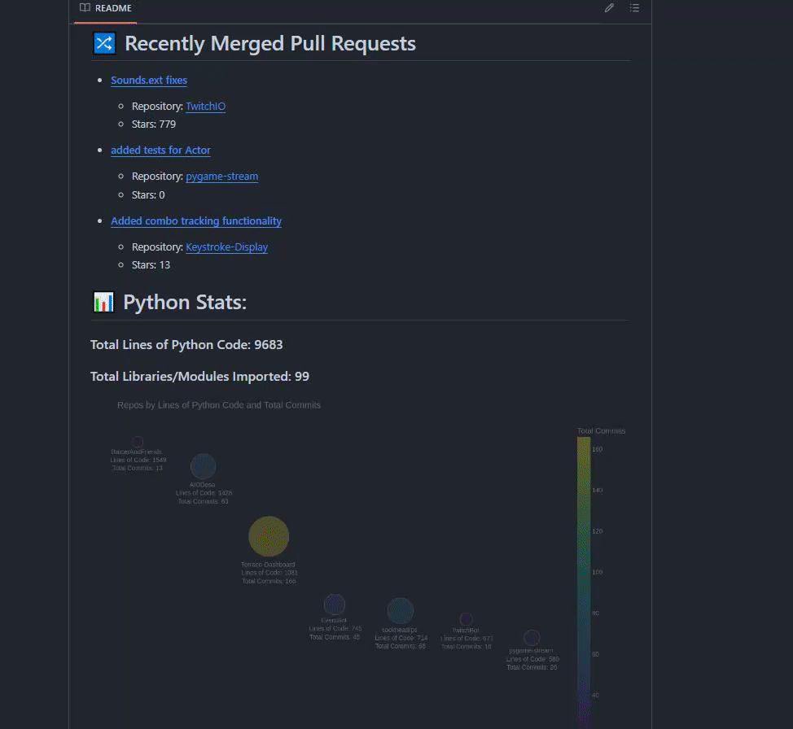

## Instructions

<details>
<summary>Making a Github API token</summary>

### Click your profile picture and go to Settings

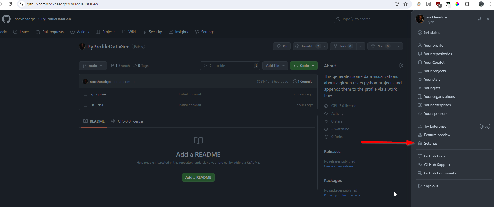

### Click on Dev Settings

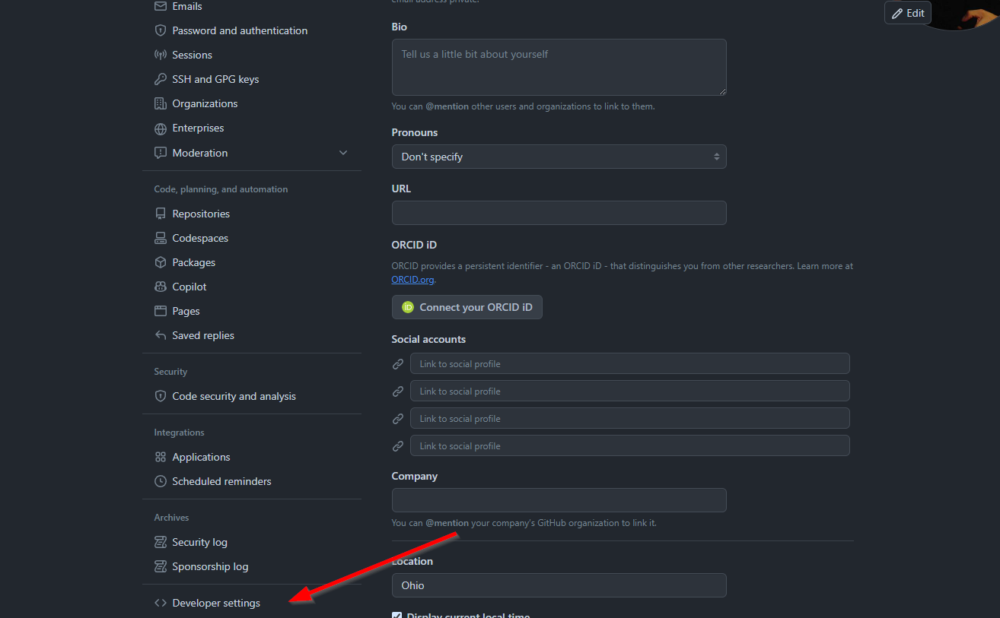

### Click on Token (classic) then Generate a new token (classic)

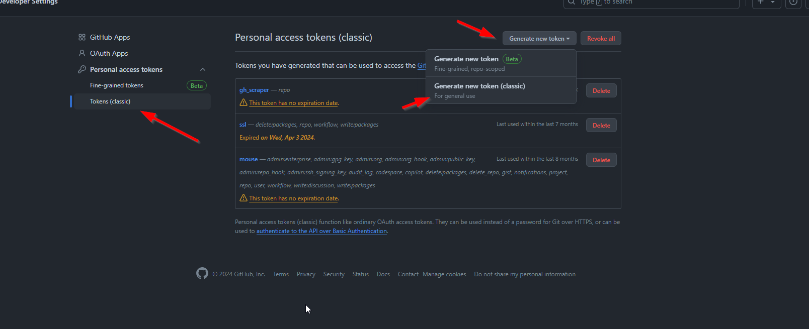

### Generate your Token

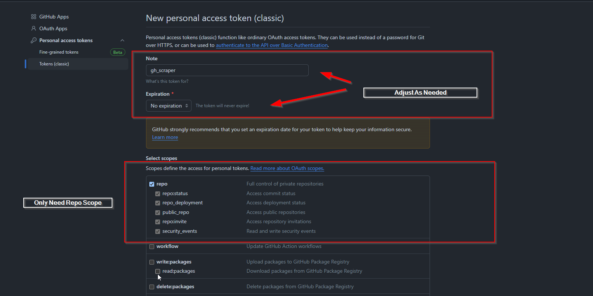

### Create a .env file in the root directory of your profile, make sure .env is in your .gitignore

```
TOKEN=YOUR_API_TOKEN
```

</details>

<details>
<summary>Saving Github API token for the github action</summary>

### Go to your profile repo and click on settings

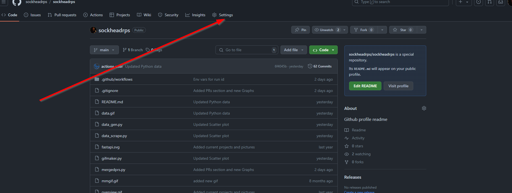

### Click on Secrets and Variables, then Actions, then New Repository Secret

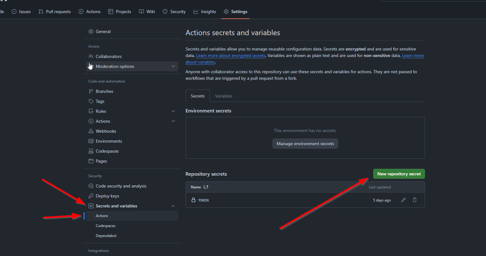

### Create a new secret with the name TOKEN, and use the github api key we generated, then click Add Secret

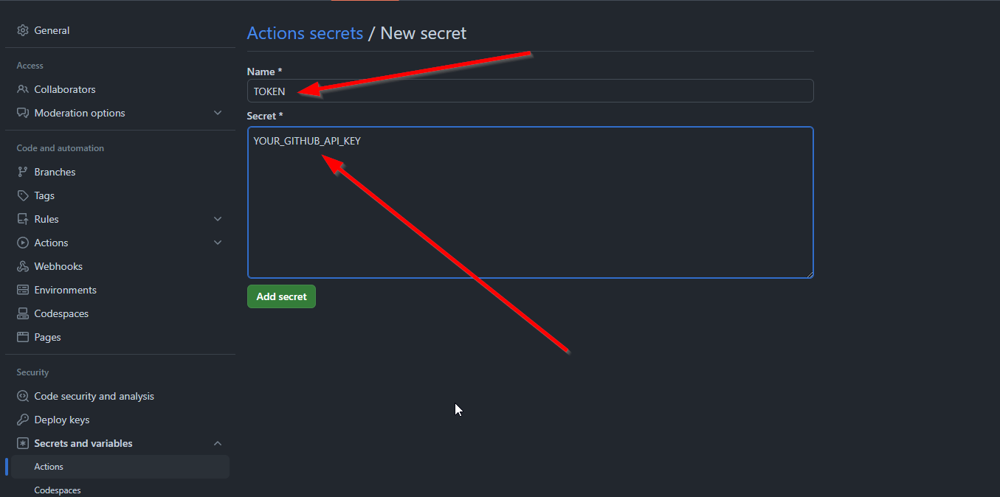

</details>

<details>

<summary>Copy and save the config to your profile repo</summary>

### Copy the config from the [PyProfileDataGen repo](https://github.com/sockheadrps/PyProfileDataGen/blob/main/config.ini) to your profile repo.

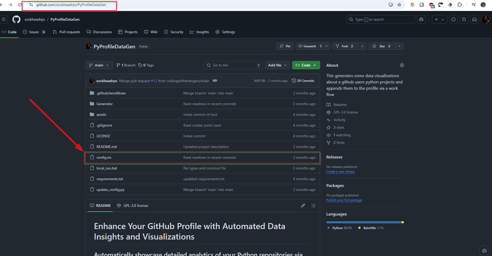

### Paste this config into your profile repo as config.ini Edit the username value with your own, and any other configs you might want to change


### open your profile README.md and add

```
---
```

to the end of the file.

Make sure --- doesnt appear anywhere else in your markdown. This is how the python script identifies the end of your readme.md to append / update data

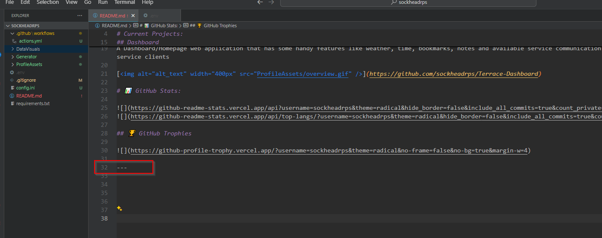

</details>

<details>

<summary>Copy github workflow action into your profile repo</summary>
<br>

go to your github profile, add the directory .github/workflows and add a file, actions.yml. Paste the contents of [this action file](https://github.com/sockheadrps/PyProfileDataGen/blob/main/.github/workflows/actions.yml) into it.

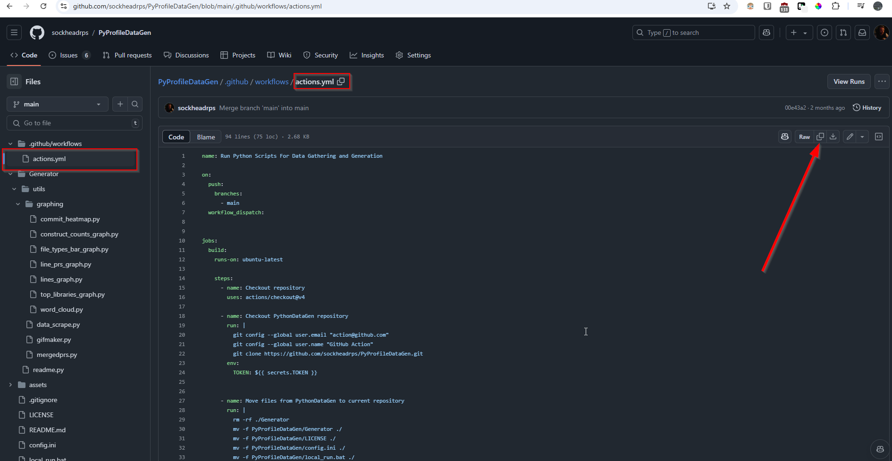
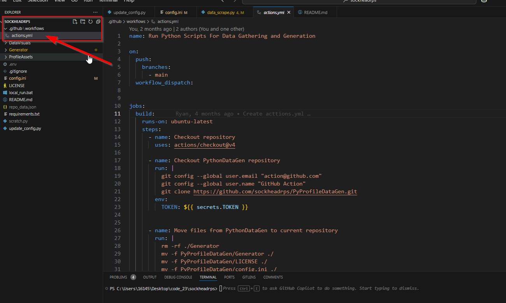

</details>

<details>
<summary>Push to your profile repo</summary>
<br>

```
git add .
git commit -m "Updating profile"
git push
```

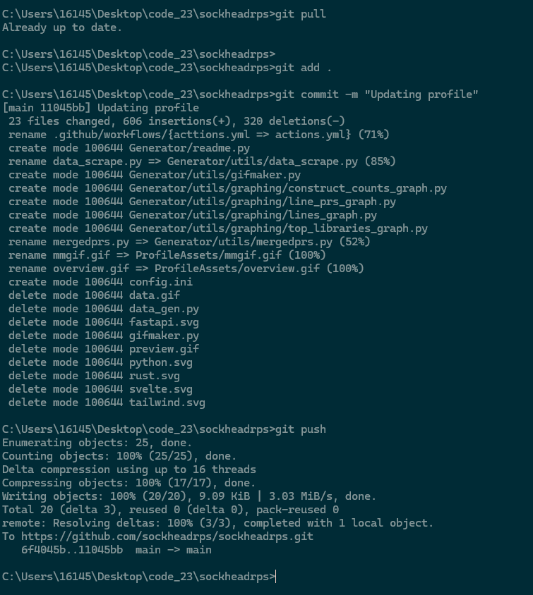

### Open your github profile repo and navigate to the build of your action you just initialized when you pushed

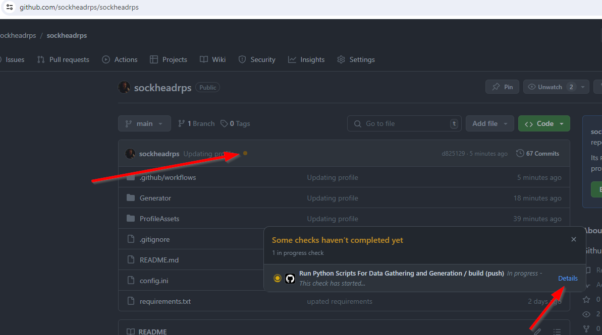

This will always take a few minutes if you have a lot of repos.

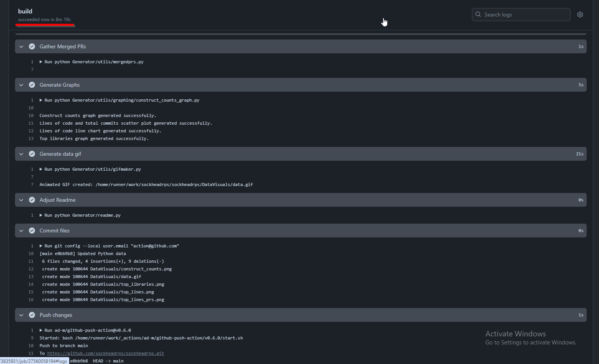

### Once this build finished your Profile will be updated and ready!

</details>
