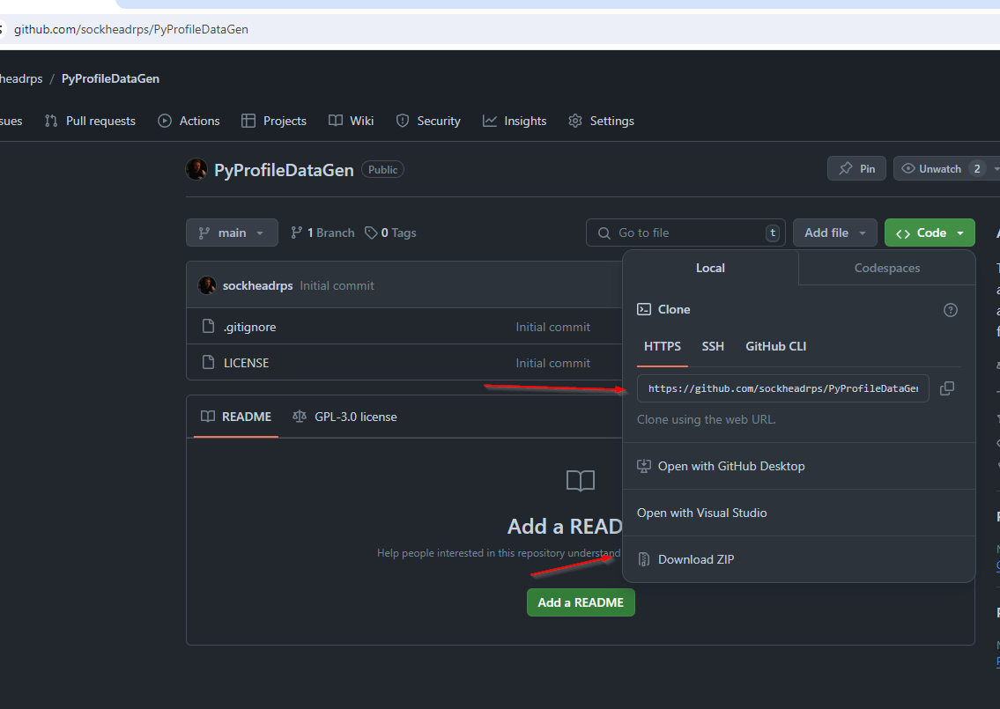
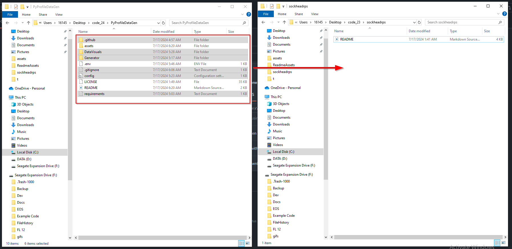
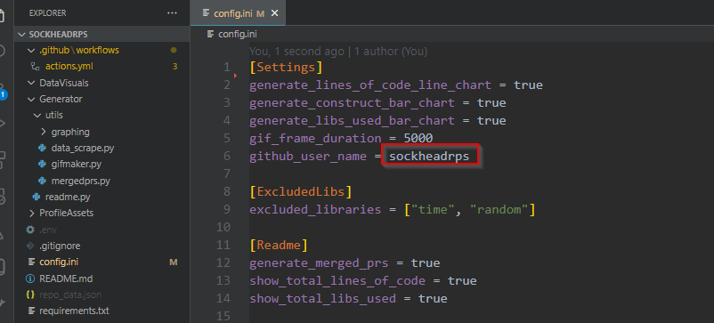
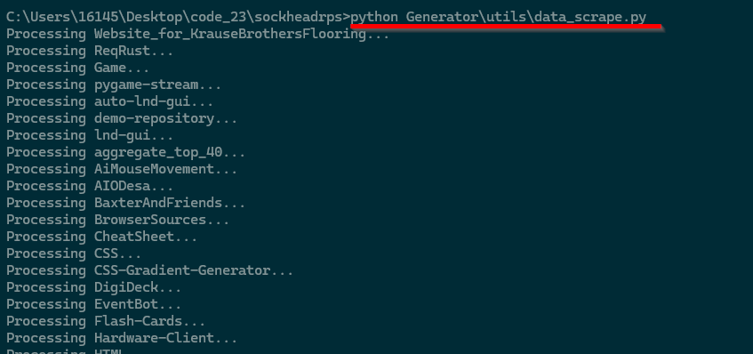
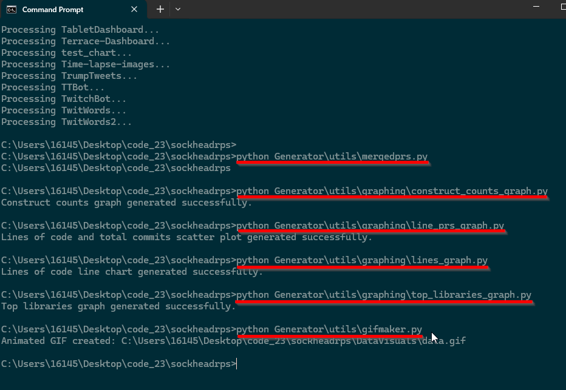

# Add some data and visualizations to your github profile via github actions!

## This tool appends some data and data visualizations to your github profile automatically on push via github actions.

### It appends and updates to your profile at the bottom, so you can keep all your other information the same without worrying about it.

## Instructions
<details>
<summary>Making a Github API token</summary>

### Click your profile picture and go to Settings


### Click on Dev Settings


### Click on Token (classic) then Generate a new token (classic)


### Generate your Token


### Create a .env file in the root directory of your profile, make sure .env is in your .gitignore

```
TOKEN=YOUR_API_TOKEN
```

<!-- Add any other content related to this section here -->

</details>


<details>
<summary>Saving Github API token for the github action</summary>

### Go to your profile repo and click on settings


### Click on Secrets and Variables, then Actions, then New Repository Secret


### Create a new secret with the name TOKEN, and use the github api key we generated, then click Add Secret


</details>

<details>

<summary>Clone this repo or save it from github and prepare your profile repo</summary>

### Clone or save


### Open the folder you just saved this repo to, as well as the folder containing your profile repo. Move the highlighted files


### open your profile README.md and add

```
---
```
 to the end of the file. 
 
 Make sure --- doesnt appear anywhere else in your markdown. This is how the python script identifies the end of your readme.md to append / update data


### Open config.ini and edit the username value with your own, and any other configs you might want to change



</details>


<details>

<summary>(Optional) Test the data gen locally</summary>


go to your github profile page repo in your terminal and run:
```
python Generator\utils\data_scrape.py
```
This may take a few minutes depending on how many repos youve uploaded



### Run the following commands. 

mergedprs.py must be run first
```
python Generator\utils\mergedprs.py
```
these can be run in any order
```
python Generator\utils\graphing\construct_counts_graph.py
```

```
python Generator\utils\graphing\line_prs_graph.py
```

```
python Generator\utils\graphing\lines_graph.py
```

```
python Generator\utils\graphing\top_libraries_graph.py
```
```
python Generator/utils/graphing/word_cloud.py
```
```
Generator/utils/graphing/commit_heatmap.py
```
then run
```
python Generator\utils\gifmaker.py
```
and finally run
```
python Generator\readme.py
```


### Now look at the data appended in your README.md

</details>

<details>
<summary>Push to your profile repo</summary>
<br>
This pull isnt necessary on the initial commit of this, but after this first commit github Actions will be updating your readme automatically, meaning the readme.md will have changes that our local repo doesnt have. To resolve this any time we want to re-run our data generation, we should pull.

```
git pull
git add .
git commit -m "Updating profile"
git push
```


### Open your github profile repo and navigate to the build of your action you just initialized when you pushed


This will always take a few minutes if you have a lot of repos. I have about 40 and it takes between 5-10 minutes to run on github.


### Once this build finished your Profile will be updated and ready!


</details>
